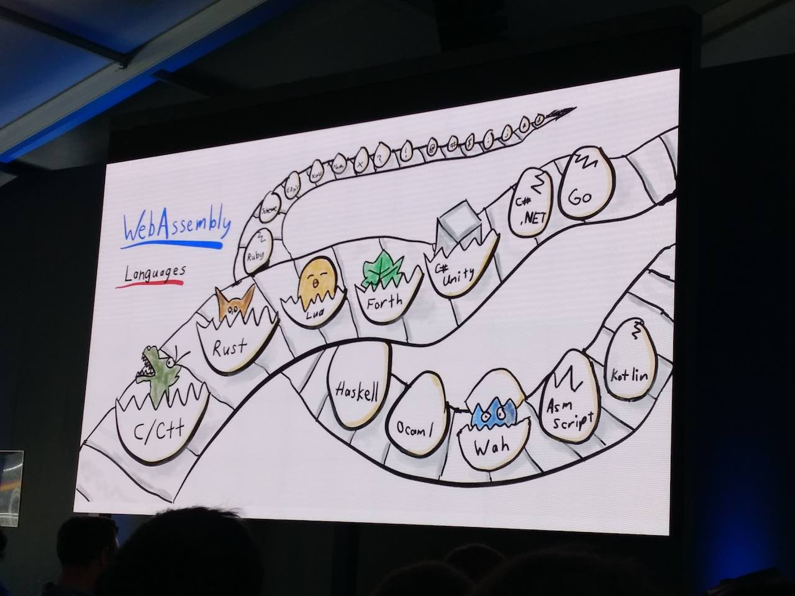

# 各言語の wasm 対応状況

[Google I/O 2018 のブログ記事](https://edwardkenfox.com/blog/google-io-2018-day2/) より、

* サポートされそうなやつは、卵にヒビが入ってる
  * 見たところ Kotlin、Asm script、C# .NET、あと Ruby あたりにもヒビが入っている
  * Go もヒビ入っている
