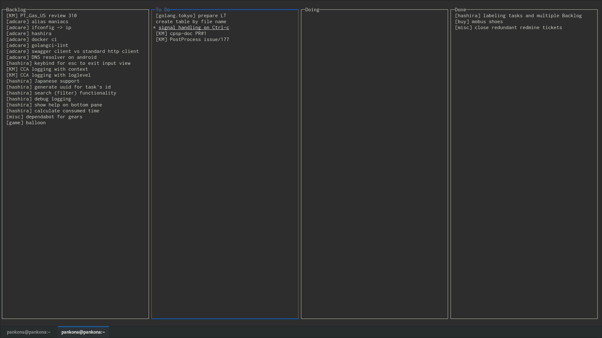

# hashira のこと

hashira という名前の ToDo 管理アプリを作っているので紹介します。

## hashira とは何か

- Qiita のアドカレで紹介した記事 - [ひとりかんばん的な ToDo 管理アプリ「hashira」を Go で作っているぞ - Qiita](https://qiita.com/pankona/items/f5e600ef372f00db978b)

- リポジトリ - https://github.com/pankona/hashira
- 最新リリースは [v1.7.1](https://github.com/pankona/hashira/releases) です。Mac/Linux (32bit/64bit) 対応です！よかったら試してみてね！

hashira とは何かをざっくり言うと、

- ひとりかんばん的 TODO 管理アプリ
- hashira という名前は見た目的に柱が立ってるっぽいので
- タスクの詳細などを書くことはできない (タスク名だけ)
- タスクの順番を入れ替えることができる

- 見た目はこんな感じ



## コンセプト

- 新しいタスクは上に追加されるように作っている
- ターミナルで完結するので手軽

## 少し中身のこと

(多分に未実装部分を含みます)

簡単なモジュール図はこんな感じ。

```uml
@startuml

skinparam monochrome true
skinparam defaultFontSize 18
skinparam defaultFontName courier

package local {
    package pc {
        class pc_cli {
        }
        class pc_gui {
        }
        class pc_daemon {
        }
    }

    package android {
        class android_gui {
      }
        class android_daemon {
        }
    }
}

package cloud {
    class datastore {
    }
}

pc_cli      --> pc_daemon
pc_gui      --> pc_daemon
android_gui --> android_daemon

pc_daemon      --> datastore
android_daemon --> datastore

@enduml
```

クライアントサーバーモデル (通信は gRPC)

- 一応、ポイントはデーモンの存在
- マルチデバイスに使えるようにしたいので、データはクラウドに保存する想定
- なんだけど、オフラインでも使えるようにしたいので、ローカルでもデータを貯め込むことができる仕組みにしている
- いまは pc_cli と pc_daemon 部分だけが実装されている状態

データ構造

- ローカルにおける CRUD はデーモンが担当
- フロント側からリクエストを受けたデーモンがリクエスト内容に従ってデータを保存
- ドキュメントストア (BoltDB) を利用。選定にあんまり意味はない
- タスクそのものと、タスクの順番を別に保存している
- 以下は protobuf の定義ファイル

```proto
// 各タスクの状態を示す enum
enum Place {
    BACKLOG = 0;
    TODO    = 1;
    DOING   = 2;
    DONE    = 3;
}

// タスク
message Task {
    string id        = 1;
    string name      = 2;
    Place  place     = 3;
    bool   isDeleted = 4;
}

// タスクの順番
message Priority {
    repeated string ids = 1;
}
```

順番入れ替え時に変更範囲が少なく済むように考慮し、以下の単位で保存している

- Task そのものをガッツリ入れるところ
- BACKLOG の Priority
- TODO の Priority
- DOING の Priority
- DONE の Priority

あるタスクの順番を入れ替える際には、ひとつの Priority だけ変更すれば良いことになるが、
状態を変える (タスクを BACKLOG から TODO に移す、など) は多少めんどう

## 難しいところ

順番が頻繁に入れ替わるリストの表現

- いろんな方式があることを知る。どれも一長一短。
  - タスクに順番を示す数値を持たせる？
  - タスクに next、prev のような構造を持たせる？

TUI 上での実装は割と面倒

- 半角と全角の入り混じり入力
- キーバインドは自分で作らないといけない

フレームワーク側 ([jroimartin/gocui](https://github.com/jroimartin/gocui))がメンテされてない

- 自分でフォークして直すしかない現状でつらい
- マルチバイト文字対応など

## 今後のこと

- マルチデバイス (Android/iOS、ウェブ版、スタンドアロンアプリ版) 対応
  - 目下クラウド側の機能を実装中 (主に GCP を利用)
  - その後、Android のウィジェットを作るところからやる予定

TUI 作るだけで半年くらい掛かっていて、全部できあがるまでに何年かかるか分からないペースだがぼちぼちやっていくぞ
