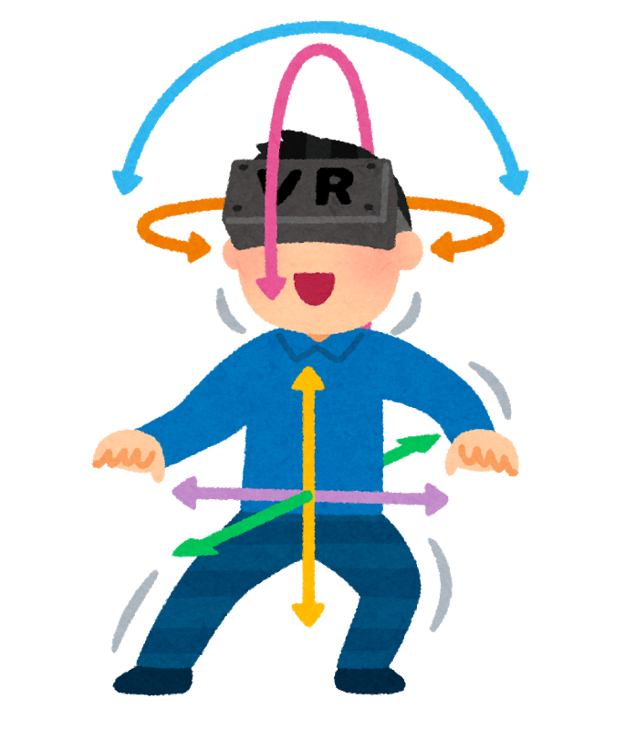

# Oculus Quest

## Oculus Quest とは

- 6 DoF 対応のワイヤレス VR ゴーグル
- 6 DoF 対応でワイヤレスな VR ゴーグルはおそらく当時 (2019/05 時点) は世界初！

<figure id="6dof">
  
  <figcaption>6 DoF でゴーグルの傾きと前後左右上下の位置を認識できる</figcaption>
</figure>

<figure id="wireless">
  
  <figcaption>ワイヤレスなのでケーブルがひっかかることもない</figcaption>
</figure>

## 経費にて購入

## デモ
